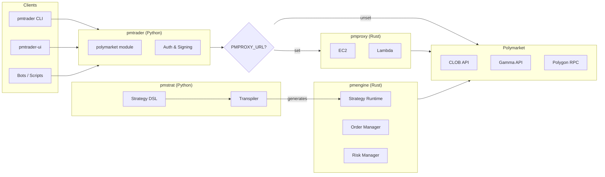

# pmt

Polymarket trading toolkit.

```
pmtrader/   Python SDK + CLI + Streamlit UI
pmproxy/    Rust reverse proxy (EC2/Lambda)
pmengine/   Rust HFT trading engine
pmstrat/    Python strategy DSL + backtesting
```

## Architecture



## pmtrader

```bash
cd pmtrader && uv sync
```

```bash
uv run python main.py           # browse markets
uv run python scan.py cliff     # order book cliffs
uv run python scan.py expiring  # expiring opportunities
uv run python trade.py          # interactive trading
uv run pmtrader-ui              # streamlit UI
```

### Config

```bash
# .env (for trading)
PM_PRIVATE_KEY=0x...
PM_FUNDER_ADDRESS=0x...
PM_SIGNATURE_TYPE=1             # 0=EOA, 1=Poly Proxy, 2=EIP-1271

# optional
PMPROXY_URL=http://localhost:8080
```

### API

```python
from polymarket import clob, gamma

clob.sampling_markets(limit=10)
clob.order_book(token_id)
gamma.events(limit=10)
gamma.search(query)
```

## pmproxy

```bash
cd pmproxy && cargo build --release --features ec2
./target/release/pmproxy
```

Routes `/clob/*`, `/gamma/*`, `/chain/*` to Polymarket APIs.

See [pmproxy/README.md](pmproxy/README.md).

## pmengine

```bash
cd pmengine && cargo build --release --features ec2
./target/release/pmengine --dry-run
```

### Config

```bash
# .env
PMENGINE_PRIVATE_KEY=0x...
PMENGINE_MAX_POSITION_SIZE=1000
PMENGINE_MAX_TOTAL_EXPOSURE=5000
PMENGINE_TICK_INTERVAL_MS=1000
```

## pmstrat

```bash
cd pmstrat && uv sync
uv run pmstrat
```

Strategy DSL and backtesting framework. Define strategies in a constrained Python subset using the `@strategy` decorator, backtest locally, then transpile to Rust for execution by pmengine.

```
Python Strategy (pmstrat DSL)
    ↓ transpile
Rust Strategy Code
    ↓ compile into
pmengine binary
    ↓ execute
Polymarket (production)
```

## Test

```bash
cd pmtrader && uv run pytest      # Python SDK tests
cd pmstrat && uv run pytest       # Strategy tests
cd pmproxy && cargo test          # Proxy tests
cd pmengine && cargo test         # Engine tests
```
