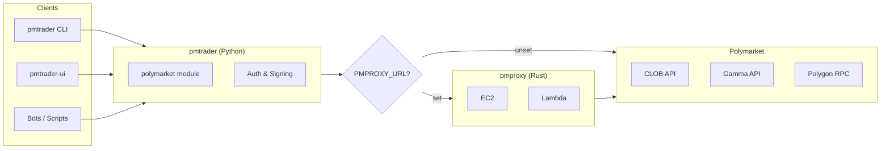

# pmt

Polymarket trading toolkit.

```
pmtrader/   Python client + Streamlit UI
pmproxy/    Rust reverse proxy
```

## Architecture



## pmtrader

```bash
cd pmtrader && uv sync
```

```bash
uv run python main.py           # browse markets
uv run python scan.py cliff     # order book cliffs
uv run python scan.py expiring  # expiring opportunities
uv run python trade.py          # interactive trading
uv run pmtrader-ui              # streamlit UI
```

### Config

```bash
# .env (for trading)
PM_PRIVATE_KEY=0x...
PM_FUNDER_ADDRESS=0x...
PM_SIGNATURE_TYPE=1             # 0=EOA, 1=Poly Proxy, 2=EIP-1271

# optional
PMPROXY_URL=http://localhost:8080
```

### API

```python
from polymarket import clob, gamma

clob.sampling_markets(limit=10)
clob.order_book(token_id)
gamma.events(limit=10)
gamma.search(query)
```

## pmproxy

```bash
cd pmproxy && cargo build --release
./target/release/pmproxy
```

Routes `/clob/*`, `/gamma/*`, `/chain/*` to Polymarket APIs.

See [pmproxy/README.md](pmproxy/README.md).

## Test

```bash
cd pmtrader && uv run pytest
```
