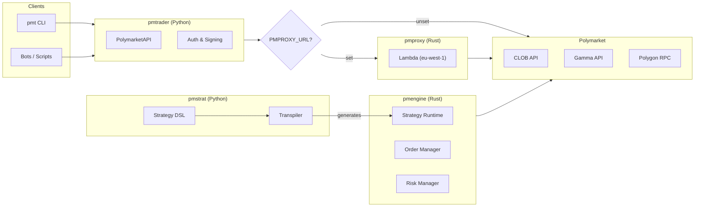

# pmt

[](https://github.com/hunterjsb/pmt/actions/workflows/ci.yml)
[](https://github.com/hunterjsb/pmt/releases?q=pmproxy)
[](https://github.com/hunterjsb/pmt/releases?q=pmengine)
[](https://github.com/hunterjsb/pmt/releases?q=pmtrader)

Polymarket trading toolkit.

```
pmtrader/   Python SDK + CLI
pmproxy/    Rust reverse proxy (Lambda live; EC2 binary as fallback)
pmengine/   Rust HFT trading engine
pmstrat/    Python strategy DSL + backtesting + transpiler to Rust
```

## Architecture


```mermaid
flowchart LR
    subgraph Clients
        CLI["pmt CLI"]
        BOT["Bots / Scripts"]
    end

    subgraph PMT["pmtrader (Python)"]
        API["PolymarketAPI"]
        AUTH["Auth & Signing"]
    end

    subgraph STRATDSL["pmstrat (Python)"]
        DSL["Strategy DSL"]
        TRANS["Transpiler"]
    end

    subgraph ENGINE["pmengine (Rust)"]
        STRAT["Strategy Runtime"]
        ORDER["Order Manager"]
        RISK["Risk Manager"]
    end

    DSL --> TRANS
    TRANS -->|"generates"| STRAT

    CLI --> PMT
    BOT --> PMT

    PMT --> DECIDE{"PMPROXY_URL?"}

    subgraph PROXY["pmproxy (Rust)"]
        LAMBDA["Lambda (eu-west-1)"]
    end

    DECIDE -->|set| PROXY
    DECIDE -->|unset| POLY

    subgraph POLY["Polymarket"]
        CLOB["CLOB API"]
        GAMMA["Gamma API"]
        RPC["Polygon RPC"]
    end

    PROXY --> POLY
    ENGINE --> POLY
```

## pmtrader

```bash
cd pmtrader && uv sync
```

```bash
pmt --help                                                  # list subcommands
pmt buy   --token hantavirus-pandemic:no --price 0.93 --size 217
pmt flip  --token hantavirus-vaccine:yes --buy-price 0.09 --sell-price 0.10 --size 850
pmt positions --orders                                      # portfolio + open orders + exposure
pmt rewards --days 7                                        # REWARD + YIELD income
pmt search pandemic                                         # cross-market search
pmt scan cliff                                              # opportunity scanners (separate CLI)
```

See [pmtrader/README.md](pmtrader/README.md) for the full CLI reference.

### Config

```bash
# .env (for trading)
PM_PRIVATE_KEY=0x...
PM_FUNDER_ADDRESS=0x...
PM_SIGNATURE_TYPE=1             # 0=EOA, 1=Poly Proxy, 2=EIP-1271

# pmproxy (required to trade from a geoblocked region)
PMPROXY_URL=https://<...>.lambda-url.eu-west-1.on.aws
PMPROXY_USERNAME=...
PMPROXY_PASSWORD=...
```

### Python SDK

```python
from polymarket import PolymarketAPI

api = PolymarketAPI()
api.place_buy(token=..., price=0.93, size=217)
api.flip(token=..., buy_price=0.09, sell_price=0.10, size=850)
api.get_positions()
api.search_markets("pandemic")
```

## pmproxy

```bash
cd pmproxy && cargo build --release --features ec2
./target/release/pmproxy
```

Routes `/clob/*`, `/gamma/*`, `/chain/*` to Polymarket APIs.

See [pmproxy/README.md](pmproxy/README.md).

## pmengine

```bash
cd pmengine && cargo build --release --features ec2
./target/release/pmengine --dry-run
```

### Config

```bash
# .env
PMENGINE_PRIVATE_KEY=0x...
PMENGINE_MAX_POSITION_SIZE=1000
PMENGINE_MAX_TOTAL_EXPOSURE=5000
PMENGINE_TICK_INTERVAL_MS=1000
```

## pmstrat

```bash
cd pmstrat && uv sync
uv run pmstrat
```

Strategy DSL and backtesting framework. Define strategies in a constrained Python subset using the `@strategy` decorator, backtest locally, then transpile to Rust for execution by pmengine.

```
Python Strategy (pmstrat DSL)
    ↓ transpile
Rust Strategy Code
    ↓ compile into
pmengine binary
    ↓ execute
Polymarket (production)
```

## Test

```bash
cd pmtrader && uv run pytest      # Python SDK tests
cd pmstrat && uv run pytest       # Strategy tests
cd pmproxy && cargo test          # Proxy tests
cd pmengine && cargo test         # Engine tests
```
