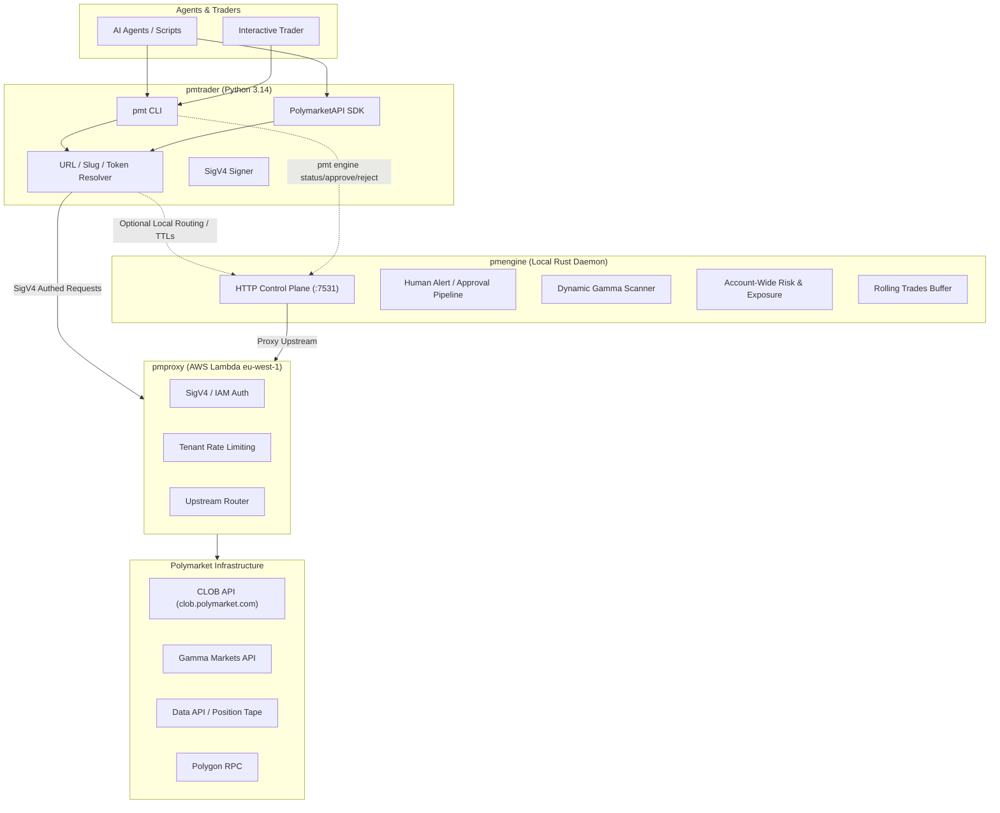

# pmt

[](https://github.com/hunterjsb/pmt/actions/workflows/ci.yml)
[](https://github.com/hunterjsb/pmt/releases?q=pmproxy)
[](https://github.com/hunterjsb/pmt/releases?q=pmengine)
[](https://github.com/hunterjsb/pmt/releases?q=pmtrader)

Polymarket trading toolchain designed for agentic workflows, discretionary execution, and algorithmic market making.

```
pmtrader/   Python SDK + pmt CLI (Agentic trading cockpit, portfolio & PnL, order routing)
pmproxy/    Rust reverse proxy (AWS Lambda in eu-west-1 w/ SigV4-authed Function URL)
pmengine/   Rust execution & risk daemon (HTTP control plane, trade buffer, human-in-the-loop alerts)
pmstrat/    Python strategy DSL + transpiler to Rust for high-throughput execution
```

---

## Architecture


```mermaid
flowchart TD
    subgraph UsersAndAgents["Agents & Traders"]
        AGENT["AI Agents / Scripts"]
        USER["Interactive Trader"]
    end

    subgraph PMTRADER["pmtrader (Python 3.14)"]
        CLI["pmt CLI"]
        SDK["PolymarketAPI SDK"]
        RESOLVE["URL / Slug / Token Resolver"]
        SIGV4["SigV4 Signer"]
    end

    AGENT --> CLI
    AGENT --> SDK
    USER --> CLI

    CLI --> RESOLVE
    SDK --> RESOLVE

    subgraph ENGINE_LOCAL["pmengine (Local Rust Daemon)"]
        CP["HTTP Control Plane (:7531)"]
        ALERTS["Human Alert / Approval Pipeline"]
        SCANNER["Dynamic Gamma Scanner"]
        RISK["Account-Wide Risk & Exposure"]
        TRADES["Rolling Trades Buffer"]
    end

    RESOLVE -.->|"Optional Local Routing / TTLs"| CP
    CLI -.->|"pmt engine status/approve/reject"| CP

    subgraph PROXY["pmproxy (AWS Lambda eu-west-1)"]
        AUTH["SigV4 / IAM Auth"]
        RATELIMIT["Tenant Rate Limiting"]
        ROUTE["Upstream Router"]
    end

    RESOLVE -->|"SigV4 Authed Requests"| PROXY
    CP -->|"Proxy Upstream"| PROXY

    subgraph POLY["Polymarket Infrastructure"]
        CLOB["CLOB API (clob.polymarket.com)"]
        GAMMA["Gamma Markets API"]
        DATA["Data API / Position Tape"]
        RPC["Polygon RPC"]
    end

    PROXY --> POLY
```

---

## 1. `pmtrader` (`pmt` CLI & Python SDK)

The central daily driver for agentic and manual trading. All orders support Polymarket event URLs, slug URLs, or direct token IDs, with `--amount $X` notionals, multi-market disambiguation (`--match`), and automatic SigV4 signing through `pmproxy`.

```bash
cd pmtrader && uv sync
```

### Orders & Execution
```bash
# Place orders using Polymarket URL or slug
pmt buy  https://polymarket.com/event/btc-updown-4h-1779825600 down --amount $910
pmt sell nobel-peace-prize-winner-2026 no --amount $50 --match Trump

# Direct token limit orders
pmt buy  14658893069672317885... --price 0.92 --size 217
pmt sell 14658893069672317885... --price 0.98 --size 50

# Market sweep: sweep all asks ≤ 0.95 and optionally place a take-profit flip
pmt sweep URL yes --to 0.95 --max-cost $150 --dry-run
pmt sweep 14658... --to 0.95 --flip 0.99

# Auto-cancel with TTL (routes through local pmengine when active)
pmt buy URL no --amount $50 --ttl 30m
```

### Portfolio, PnL & Market Discovery
```bash
pmt balance                          # Spendable USDC vs cash locked in resting BUYs
pmt positions --orders               # Live positions, open orders & theme exposure
pmt pnl                              # Realized (1d/7d/30d/all) & unrealized (matches polymarket profile)
pmt rewards --days 7                 # REWARD + YIELD distributions
pmt book URL yes                     # Depth chart with mid price and spread
pmt search pandemic                  # Query active markets by keyword
pmt scan REF                         # Pre-trade due-diligence scan on an event
```

See [pmtrader/README.md](pmtrader/README.md) for the full CLI reference.

---

## 2. `pmengine` (Execution & Risk Daemon)

High-performance Rust trading daemon that manages WebSocket orderbooks, enforces portfolio risk limits, runs transpiled strategies, and exposes a local HTTP control plane (`http://127.0.0.1:7531`).

```bash
cd pmengine && cargo build --release --features ec2
./target/release/pmengine run updown
```

`updown` (the crypto up/down trigger) is the only registered strategy — the eight dormant
example strategies that shipped alongside it were deleted in the 2026-08 cleanup. `pmengine
list` is the live answer.

### Key Capabilities
- **Local Control Plane**: `pmt engine status`, `pmt engine strategies`, and `pmt engine subscriptions`.
- **Human-in-the-Loop Alerts**: Strategies can emit `Signal::Alert` for high-edge opportunities; review and approve them via `pmt engine alerts` and `pmt engine approve <id>`.
- **Position Reconciliation**: Automatically syncs with Polymarket Data API every 30s to eliminate fill accounting drift.
- **Dynamic Scanner**: Subscribes and unsubscribes tokens on the fly based on strategy `MarketFilter` rules.

---

## 3. `pmproxy` (AWS Lambda Gateway)

Rust reverse proxy deployed as an AWS Lambda with a Function URL in `eu-west-1` (near Polymarket infrastructure).

- **Geoblock Bypass**: Bridges requests to `clob.polymarket.com`, `gamma-api.polymarket.com`, and Polygon RPC.
- **Security & Multi-Tenancy**: SigV4 client signing against an `AWS_IAM` Function URL, plus per-tenant rate limiting. (A Cognito JWT gate exists in `auth.rs` but is disabled in the live deployment.)
- **Automated CI/CD**: Managed via Pulumi (`infra/pulumi/`) and auto-deployed via GitHub Actions OIDC on version bumps.

See [pmproxy/README.md](pmproxy/README.md).

---

## 4. `pmstrat` (Strategy DSL & Transpiler)

Define trading strategies in a clean Python subset, validate with local backtesting, and transpile to high-performance Rust for `pmengine`.

```bash
cd pmstrat && uv sync
uv run pmstrat transpile --all      # Transpile Python strategies to Rust
uv run pmstrat lint my_strategy     # Validate strategy DSL
```

`pmstrat/strategies/` ships empty: every built-in DSL strategy was deleted in the 2026-08
cleanup, alongside the Rust it transpiled to. Leaving the sources would have let the next
`transpile --all` put the dead Rust back.

---

## Testing

```bash
(cd pmproxy && cargo test)                           # Proxy tests
(cd pmengine && cargo test)                          # Engine & strategy integration tests
(cd pmtrader && uv sync && uv run pytest tests/ -v)  # Trader CLI & SDK tests
(cd pmstrat && uv sync && uv run pytest tests/ -v)   # DSL & transpiler tests
```
